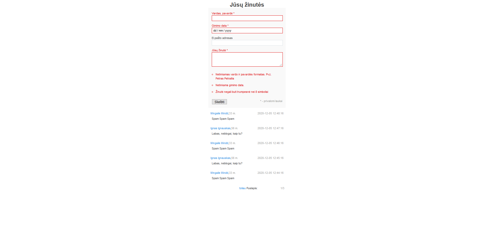
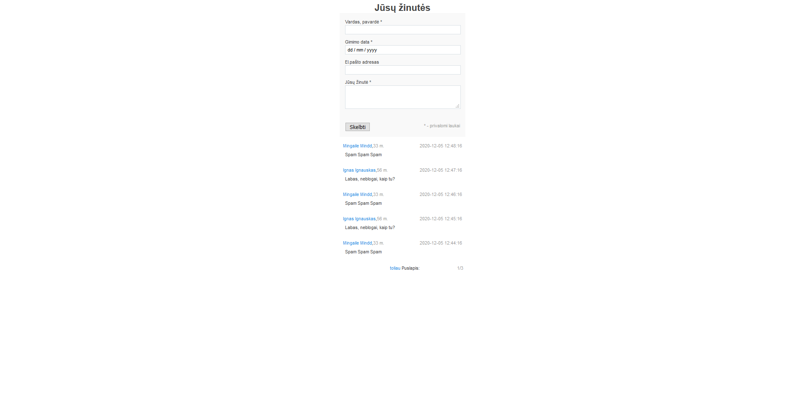

# PHP Message board

Message board web app built with plain PHP and javascript. Uses MYSQL DB to store messages

---
## Requirements

**Main**
* [x] PHP7 code must be object oriented. Should not use any PHP framework if possible.
* [x] PHP7 with MySQL the database will also have to communicate through a designated object.
* [x] System should fully support JavaScript switched on and off. (If JavaScript is disabled, the system should still be useable.)
* [x] Database structures should be created by you.
* [x] AJAX query results must be sent in XML or JSON format.

**If JavaScript is enabled:**
* [x] After pressing the submit button, all fields have become inactive (not editable), and instead loader diagram should appear.
* [x] In case of success, the most recent message should be placed on top using JavaScript The oldest message should be removed from the screen. All form fields should be activated again.
* [x] In case any errors are detected, fields must be marked and fields should be activated so that user can edit their input.
* [x] In both cases, the loader should disappear and the button should appiear instead.

**If JavaScript is turned off:**
* [x] Pressing the button should reload the page. 

**Other**
* [x] If an e-mail was provided, the name and last name should become a link. (By clicking on the full name, an e-mail is triggered.)
* [x] Year must be calculated from the current date and the date of birth entered.

**Pagination**
* [x] All messages should be paginated. Number of posts per page should be defined in constants.

**Validation** (Frontent & backend)
* [x] All form fields must be validated, even if the field is optional, but contains some input from user.
* [x] In case of an error, fields must be marked with incorrect information.
* [x] The name must consist of two inputs - Name and Last name. Only alphabetical symbols should be allowed in these fields. No numbers.   
* [x] Date of birth must be correctly formatted, the existing date (can not be February 30th.) And can not be a future date.
* [x] E-mail address is optional, but if entered, must be validated.
* [x] Message field is mandatory.
* [x] All form fields should be protected against XSS, SQL / JavaScript intections. HTML input should not be allowed. Inputs containing HTML text should be cleaned from any HTML code before they are saved in database.
---
## Folder structure
```bash
/api
    -/messages.php # server file that frontend interacts with
/assets
    -/css
    -/img
    -/js
/data
/mysql
/src
    -/config     # server config file
    -/database   # database object 
    -/helpers    # helper classes to manipulate data
    -/models     # database objects
.gitignore
docker-compose.yml
index.html
README.md
seed.php # data seeder
```
---

## Installation
PHP v.7.4

**Note** If using docker, create empty directory with name `mysql`

Connect database:
```bash
# /src/config/database

$host       = "";
$dbname     = "message_board"; # leave this dbname
$username   = "";
$password   = "";

```

```
# clone directory
git clone https://github.com/EvaldasBurlingis/emotion-messageboard.git

# cd directory
cd emotion-messageboard

# start php server
php -S localhost:8000

# create & seed database
# go to http://localhost:8000/seed.php

# start using app

```
---
### Screenshot

<div>
    
    <br />
    
</div>
